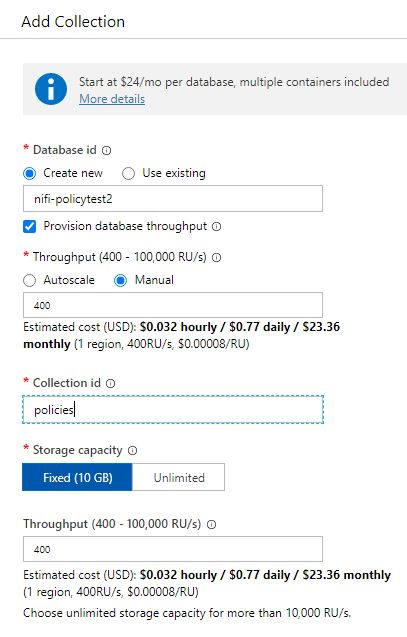

# nifi-azure-customized-bundle
This bundle includes the module that stores NIFI policies into Mongo DB (possibly Azure Cosmos with Mongo DB API).

## Pre-requsites
* Backend Data Store : This bundle needs a Mongo DB instance with the collection called 'policies' in advance. Simply you may setup an Azure Cosmos DB instance following this quick start (https://docs.microsoft.com/en-us/azure/cosmos-db/create-mongodb-java). Choose 'Fixed(10GB)' option for Stroage capacity as shown below and do not choose 'Autoscale' for scaling. You may choose to setup your own MongoDB instance if you don't have an Azure subscription.

    

* Securing NiFi with TLS: Authorization is based on authentication of user identities. Enable security in NiFi with the following documentation (https://nifi.apache.org/docs/nifi-docs/html/walkthroughs.html#securing-nifi-with-tls).

## Configuration
* Build nar files with 'mvn clean install' and copy nar files to your NIFI cluster lib directory.
```bash
cp ./nifi-azure-customized-api-nar/target/nifi-azure-customized-api-nar-1.0-SNAPSHOT.nar ${NIFI_DIR}/lib
cp ./nifi-azure-customized-nar/target/nifi-azure-customized-nar-1.0-SNAPSHOT.nar ${NIFI_DIR}/lib
```

* Update your Nifi conf/authorizers.xml with azure-access-policy-provider. Change 'User Group Provider' and 'Initial Admin Idenity' based on your choice.  For example,
```xml
<accessPolicyProvider>
    <identifier>azure-access-policy-provider</identifier>
    <class>org.apache.nifi.authorization.azure.MongoDBAccessPolicyProvider</class>
    <property name="MongoDB Connection String for Authorizations">mongodb://XXX:YYYY:10255/?ssl=true&amp;replicaSet=globaldb&amp;retrywrites=false&amp;maxIdleTimeMS=120000&amp;appName=@ZZZ@</property>
    <property name="MongoDB DB Name for Authorizations">nifi-policy</property>
    <property name="User Group Provider">composite-configurable-user-group-provider</property>
    <property name="Initial Admin Identity">CN=admin, OU=ApacheNiFi</property>
    <property name="Node Identity 1"></property>
    <property name="Node Group"></property>
    <property name="Cache Expiration Timeout">2 mins</property>
</accessPolicyProvider>

<authorizer>
    <identifier>managed-authorizer</identifier>
    <class>org.apache.nifi.authorization.StandardManagedAuthorizer</class>
    <property name="Access Policy Provider">azure-access-policy-provider</property>
</authorizer>
```

Note that in the example above, "&" in the connection string is replaced with "\&amp;" to escape in XML.